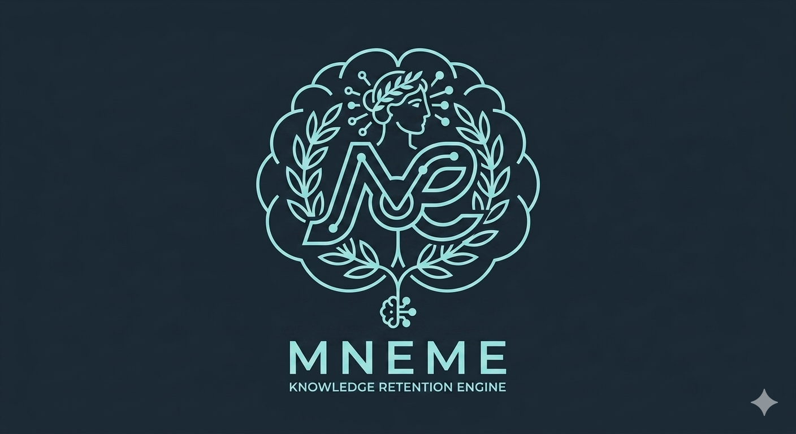
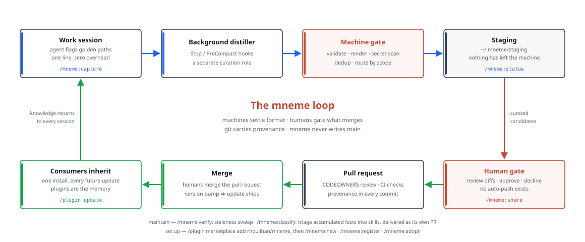

# mneme

<p align="center">
  
</p>

**The plugin is the memory. Memories are skills.**

Mneme (after the Greek muse of memory) is a knowledge-mining engine for AI coding agents. As you work, it notices hard-won knowledge — the fix that landed after three dead ends, the constraint nobody wrote down, the procedure that actually works — and decomposes it into **skills** and **facts**. Those units flow through a machine gate and a human gate into **knowledge plugins**: git repositories that are simultaneously installable agent plugins and governed knowledge commons. Anyone you grant access installs the plugin and inherits everything merged; every future merge arrives through a normal plugin update.

Companies, universities, and government agencies get repositories of institutional knowledge — products, codebases, processes, procedures, implementations — that their AI tools consume natively and their existing git governance (pull requests, CODEOWNERS, branch protection, audit history) controls completely. **No vendor SaaS anywhere in the loop.**

The destination does not have to be a knowledge repo. Point mneme at an ordinary app, service, or infrastructure repo and it keeps that team's hard-won knowledge in one directory at the root — `mneme-index/` — without turning the repo into a plugin, claiming its `skills/`, or spending its CI budget. Most knowledge is learned inside a repo that is not about knowledge at all, and that is exactly where it should live.

Don't tell the AI to document what it did. Tell it to decompose the knowledge it's mining into a collection of skills anyone in the organization can install.

## Why this doesn't already exist

We [surveyed the landscape](docs/research/2026-08-11-prior-art.md) before writing a line of code. As of mid-2026, every ecosystem has exactly one half of the loop:

- **Manual git-shared knowledge, no capture** — Cursor rules, Copilot instructions, Amp skills, CLAUDE.md/AGENTS.md files, every awesome-list commons. Communities already share agent knowledge via pull requests; they just write all of it by hand.
- **Auto-capture into a proprietary store, weak or no review, no federation** — Devin Knowledge, Augment Cosmos, Windsurf Memories, hosted memory platforms. One user's click (or no click at all) publishes to everyone, in a database you don't own.

Nobody ships **capture → local staging → user-curated review → PR into an open git repo → team inheritance via plugin updates**. The "promotion gate with a review queue" is documented in 2026 practitioner literature as the best practice teams must hand-build. Mneme is that missing intersection, built on three findings from the research:

1. **Distribution is already solved.** A knowledge repo that is also a plugin marketplace inherits versioned, SHA-pinned, org-syncable distribution for free. Mneme builds zero sync infrastructure.
2. **Review throughput kills knowledge commons, not noise.** Every commons that thrives pairs a rigid unit schema with lint-in-CI so machines settle format and humans judge only substance. Mneme scaffolds that governance into every knowledge repo it creates.
3. **Never let agents bulk-rewrite a knowledge store.** Context collapse and memory poisoning are the documented failure modes; the mitigations are delta-only edits to individually-addressable units and a human merge gate — which git provides natively.

## The loop

<p align="center">
  
</p>

Nothing leaves your machine without passing a deterministic machine gate **and** your explicit approval. Nothing enters a shared repo without a human merge: every contribution — approved harvests and classify reorganizations alike — lands on a `mneme/*` branch, pushed as a pull request when the repo has a remote and left local for you otherwise. **Mneme never writes a registered repo's `main`.** There is no auto-push and no direct-commit setting to get wrong: contributions are PR-only, by design, not by configuration — personal repos simply merge their own PRs.

On the receiving end of that loop, maintainers work the inbound queue with `/mneme:review`: every fact each open pull request adds is machine-annotated as duplicate, declined, possibly-integrated, or new, and the merge, the duplicate-closure, or the extraction of just the genuinely new bullets happens only on your explicit approval for that specific PR.

## What a knowledge plugin looks like

`mneme new acme-knowledge` generates a repo that is a valid plugin, its own single-plugin marketplace, and a governed commons on day one:

```
acme-knowledge/
├── .claude-plugin/
│   ├── plugin.json            # version bumped on every merge → consumers update
│   └── marketplace.json       # self-referential marketplace: one `add`, updates forever
├── MNEME.md                   # scope statement + sensitivity — doubles as the routing prompt
├── skills/
│   ├── <skill-name>/SKILL.md  # ← arrives with your first harvest: procedural units
│   │                          #   (Agent Skills format, portable to ~40 tools)
│   └── knowledge-index/       # mechanically regenerated router over the facts tier
│       ├── SKILL.md
│       └── facts/             # typed, tagged, dated fact bullets — delta-edited, never rewritten
│           └── <topic>.md     # ← arrives with your first harvest
├── CODEOWNERS                 # reviewer routing per knowledge area
├── CONTRIBUTING.md            # the promotion rule + anti-slop policy
├── AGENTS.md                  # how agents should read and extend this repo
├── README.md
├── .gitignore
└── .github/workflows/         # lint, secret scan, auto version bump on merge
```

Everything above except the two `←` rows exists the moment `mneme new` returns; those two
arrive with your first merged harvest. (Facts live at `skills/knowledge-index/facts/` —
canonical since v0.5.0, and every new topic goes there. A repo still carrying a legacy
top-level `facts/` stays fully readable and is migrated automatically on its next
contribution, moves included in that same pull request; `mneme migrate` covers a repo with
nothing else pending.)

An ordinary repo takes one directory instead, and nothing else:

```
payments-service/               # your app — mneme adds a corner, it does not annex it
├── MNEME.md                    # scope statement: the same routing prompt, the same marker
├── mneme-index/
│   ├── SKILL.md                # mechanically regenerated router over this repo's facts
│   ├── facts/<topic>.md        # typed, tagged, dated — delta-edited, never rewritten
│   └── CONTRIBUTING.md         # the promotion rule, inside the directory it governs
├── CODEOWNERS                  # `/mneme-index/ @your-team` — scoped, never `* @…`
└── .github/workflows/mneme-validate.yml   # fires only when the knowledge changes
```

No plugin manifest (it is not being published), no release workflow, no claim on the repo's
own `skills/` or `CONTRIBUTING.md`, and an existing `CODEOWNERS` is reported rather than
edited. `/mneme:share` and `/mneme:review` work exactly as they do in a knowledge plugin;
`/mneme:classify` is the one command that does not, because a plain repo has no destination
skills to file facts into. `mneme status` names each registered repo's mode.

For a walkthrough of all of this with real output, see [docs/getting-started.md](docs/getting-started.md).

**Skills** carry procedures with their failure patterns — knowledge enters only with evidence of success and the dead ends that made it non-obvious. **Facts** are single-line typed bullets (`decision | constraint | gotcha | runbook-note | reference`) with tags and verified-dates:

```markdown
- [constraint] Staging DB resets nightly at 04:00 UTC #staging (verified: 2026-08-11)
- [gotcha] v2 API silently truncates batch writes over 500 items #api (verified: 2026-08-11)
```

You can register **any number** of repos — personal, team, per-product, per-service — knowledge plugins and ordinary application repos side by side. Each repo's `MNEME.md` scope statement teaches the router where new knowledge belongs, and every candidate shows its target at the human gate before anything moves. Sensitivity labels (`public | internal | restricted`) mark how far each repo's knowledge may travel: a candidate captured in a more-restricted context and routed toward a less-restricted repo is flagged `[boundary]` at the gate, and re-routing one refuses the crossing without `--allow-boundary`. It is a warning rather than an enforced control — mneme tells you before you approve, and says so plainly when it could not determine where the knowledge came from.

## Status

Mneme is in active development, built plan-by-plan with strict TDD. Current state:

| Phase | Delivers | State |
|---|---|---|
| 01 — Foundation | State layout, registry, flag capture, unit formats, staging + quarantine + declined ledger, secret scan, schema lint, `mneme` CLI | ✅ merged |
| 02 — Retrieval | `mneme-index`: standalone SQLite FTS5 hybrid search over any skill/fact tree; `mneme search` / `mneme db query` | ✅ merged |
| 03 — Factory | `mneme new` scaffold factory + security hardening (SELECT-only queries, schema v2 with summaries, `db enable/disable`) | ✅ merged |
| 04 — Distiller | Routing scopes, sensitivity boundaries, session noticing brief, two-phase distill machine gate | ✅ merged |
| 05 — Harvest | `/mneme:share` review flow, git/PR plumbing with provenance trailers, staleness sweep, register/adopt for existing repos | ✅ merged |
| 06 — Adapter | Claude Code plugin wiring: hooks, `/mneme:*` commands, behavioral skills, background distiller | ✅ merged |
| 07 — Dogfood | End-to-end harness + mneme's own development-knowledge plugin, captured by mneme | ✅ merged |
| 08 — Detection | Session-start detection of unregistered knowledge repos — the injected brief asks to register (hardened against path/URL injection); persisted declines | ✅ merged (v0.3.0) |
| 09 — PR-only | Contribution modes removed: mneme never writes a repo's `main` — every harvest is a branch + PR, enforced by an invariant test | ✅ merged (v0.4.0) |
| 10 — Classify | Facts move under `skills/knowledge-index/facts/` (legacy readable); `/mneme:classify` prompt-driven librarian pass with user-approved mapping | ✅ merged (v0.5.0) |
| 11 — Review | `/mneme:review` inbound-PR triage: machine-annotated fact additions (duplicate / declined / possibly-integrated / new), per-PR human approval for every merge, closure, or extraction; deterministic fact-preservation gate at finalize | ✅ merged (v0.6.0) |
| — | Fixes: Claude Code's 500-char description limit honored end to end (index description now O(1) in fact count); secret scanner no longer blocks mneme's own topic slugs. Docs: [getting-started walkthrough](docs/getting-started.md) | ✅ merged (v0.6.1) |
| 12 — Canonical facts | Every new fact topic lands in `skills/knowledge-index/facts/`, whatever the repo's layout; a legacy root `facts/` is migrated automatically on the next contribution — history-preserving moves, merge-never-overwrite, delivered in that contribution's own PR — plus `mneme migrate` for a repo with nothing else pending | ✅ merged (v0.7.0) |
| 13 — Any repo | Register and capture into an ordinary app, service or infra repo: knowledge lives in `mneme-index/` at the root and the repo is never turned into a plugin — no manifests, no claim on its `skills/` or `CONTRIBUTING.md`, CODEOWNERS scoped to the knowledge root, CI that only runs when the knowledge changes. `/mneme:adopt` drafts the scope statement from what the repo already says about itself. `share` and `review` work in both modes; `classify` declines where there are no destination skills | ✅ merged (v0.8.0) |
| — | Hardening from a four-lens adversarial review: no write travels through a symlink (adoption could create files outside the repo via a dangling link); every preservation-gate proof asks git, and mode is read from `main` so a pass cannot vote itself powers; a knowledge repo with no plugin manifest keeps the root it already uses instead of being silently split across two | ✅ merged (v0.8.0) |
| — | Fixes: the engine imported `tomllib` (Python 3.11+) while the supported floor is 3.10, so the whole suite failed to import on the floor while passing on 3.12 — manifest fields are read with a scoped regex again, and the release tests now scan `core/` for anything newer than the floor CI actually runs | ✅ merged (v0.8.1) |
| 14 — Corrections & freshness | The gate can fix a mis-routed candidate instead of spending a decline on it (`mneme share route`), and the correction sticks — the distiller stops re-proposing the destination a human moved knowledge off. `mneme new --no-plugin` scaffolds a governed knowledge repo that is not published as one. The search index reports when it no longer speaks for a repo instead of answering from an old corpus, and rebuilds only what moved | ✅ merged (v0.9.0) |
| — | Fixes: the `[boundary]` warning now fires in the background pipeline (it never had — flags record where they were captured, and ingest takes the most restricted scope among them); `core/` takes a lock, so two concurrent writers no longer both win; and a freshness check that could not see a repo said "fresh" rather than saying it could not see | ✅ merged (v0.9.0) |

Deferred by design: vector search layer (FTS5 first), Oracle 26ai / Postgres storage drivers (interface specced), Codex adapter (the core and `mneme-index` are deliberately harness-neutral), cross-org federation tooling.

## Installing

Mneme installs like any Claude Code plugin — its repo is its own marketplace:

```
/plugin marketplace add rhoulihan/mneme
/plugin install mneme@mneme
```

Requires Python ≥ 3.10 and git on the machine; the engine is standard-library-only.

First run, hook behavior, configuration env vars, and troubleshooting: see [docs/install.md](docs/install.md).
Then walk the whole loop end to end in [docs/getting-started.md](docs/getting-started.md).

## Using mneme

**New here? Start with the [getting-started walkthrough](docs/getting-started.md)** — creating,
registering or adopting a knowledge repo, then taking one thing you learned from the moment
you learn it to a merged pull request, with real transcripts at every step.

Everything is a slash command. Behind each one, a deterministic, fully-tested CLI does the mechanical work — that separation is the design: the agent converses, the machine gates.

| Command | What it does |
|---|---|
| `/mneme:new <name>` | Interview for scope, then scaffold a governed knowledge repo — CI, CODEOWNERS, routing scope statement, and the plugin manifests that make it installable. `--no-plugin` skips the manifests for a repo nobody installs: same skills, facts and gates, just not distributed |
| `/mneme:register <name> <url>` | Register an existing repo you have access to (clones it for you); asks only for sensitivity — contributions are PR-only — and offers governance retrofit |
| `/mneme:adopt <name>` | Retrofit mneme onto an existing repo — drafts its scope from what the repo already says about itself, then adds only what's missing, never overwriting. Works on an app or service repo too: that keeps its knowledge in `mneme-index/` at the root and is never turned into a plugin |
| `/mneme:capture <note>` | Flag hard-won knowledge the moment it happens — one line, distilled in the background later |
| `/mneme:share` | The human gate: review staged candidates (diffs, boundary flags, similarity hints), approve, decline, or **re-route** one the distiller placed wrong, then harvest onto a `mneme/harvest-*` branch and open the PR |
| `/mneme:status` | Pipeline dashboard: plugins, pending flags, staging, submissions, index freshness |
| `/mneme:verify <name>` | Staleness sweep over a knowledge plugin, with guided re-verification |
| `/mneme:index` | Check whether the search index still speaks for the registered repos, and rebuild the ones that moved — `search` warns when it is stale rather than answering confidently from an old corpus |
| `/mneme:classify` | Librarian pass on the current repo: triage accumulated facts into the relevant skills' content (you approve the mapping), regenerate the knowledge-index, deliver as its own PR. Needs destination skills, so it declines in a plain repo and says what does work there |
| `/mneme:review` | Maintainer triage of the current repo's open PRs: every fact each one adds is annotated duplicate / declined / possibly-integrated / new, then you approve each merge, duplicate-closure, or extraction of the new bullets (requires the `gh` CLI) |

And mneme rides the session without being asked: a SessionStart hook injects the noticing brief so the agent flags golden paths as they happen, Stop/PreCompact hooks run the background distiller over what was flagged, and a retrieval skill has the agent search installed knowledge by vague notion before reinventing something the organization already knows — and read the warning when the index is behind, so a thin answer is never mistaken for "nobody knows this". Opening a session inside an unregistered knowledge repo (its `MNEME.md` marker present) makes the brief *ask you* whether to register it — declining is persisted, so you're never nagged twice about the same repo.

### Under the hood (contributors, CI, scripting)

Every command drives `bin/mneme`, a zero-install stdlib-only CLI you can use directly:

```bash
git clone https://github.com/rhoulihan/mneme && cd mneme
bin/mneme new acme-knowledge --owner your-team        # what /mneme:new runs
bin/mneme registry add team-kb --repo git@github.com:acme/kb.git --clone
bin/mneme search "batch truncation"                   # FTS across registered plugins
bin/mneme lint path/to/any/knowledge/repo             # machines settle format (CI runs this)
printf 'key = AKIA...' | bin/mneme scan -             # secret scan, exit 2 on blockers
python3 -m pytest                                     # test suite (dev-only dependency: pytest)
```

The `mneme-index` component also works standalone against any directory of `SKILL.md`/fact files — that's deliberate: it's the piece other harnesses can adopt directly:

```bash
bin/mneme-index --db /tmp/i.db build path/to/skill-tree
bin/mneme-index --db /tmp/i.db search "vague notion of what I need"
```

## Design principles

- **Files are canonical; everything else is derived.** Knowledge travels as reviewable markdown in git. The local database is an optional index — delete it and rebuild any time. Git gives provenance (`blame`), temporal history (`log`), rollback, and authenticated authorship for free.
- **Machine gate first, human gate second.** Deterministic code validates schema, scans for secrets, deduplicates, and routes — before you ever see a candidate. You review substance, not format.
- **LLM judgment is quarantined to prompts.** The distiller's proposals are untrusted structured data; tested code renders every unit canonically. An LLM never edits the knowledge store directly.
- **Delta edits only.** Skills are unit-granular files; facts are individually-addressable bullets. No agent may regenerate a whole store — the documented context-collapse failure mode.
- **Ride existing trust.** PRs, CODEOWNERS, branch protection, CI, marketplaces: institutions already govern code this way. Mneme makes knowledge flow through the same pipes rather than building parallel ones — which is also why it works air-gapped against self-hosted git.

## Enterprise & government posture

Everything runs locally plus your own git remote. Capture exclusions bind at the source (excluded repos/paths never even generate flags). Secret findings quarantine candidates until redacted. Sensitivity labels enforce distribution boundaries. Provenance is triple-layered: capture metadata in unit frontmatter, git authorship, and the PR review trail — tamper-evident under ordinary branch protection, and a natural fit for audit-driven environments where "reviewable artifacts" beat "ambient memory."

## Repository layout

```
core/mneme_core/    # engine: registry, staging, scan, lint, routing, scaffold, CLI
core/mneme_index/   # standalone retrieval component (imports only units+errors from core)
bin/                # zero-install launchers (mneme, mneme-index) + the background distill pipeline
docs/
├── superpowers/specs/    # the design specification
├── superpowers/plans/    # per-phase implementation plans (full TDD detail)
└── research/             # prior-art survey, platform wiring references
tests/              # pytest suite — one test module per source module
```

## How this repo is built

Mneme is developed spec-first: a [design specification](docs/superpowers/specs/2026-08-11-mneme-design.md) validated against a [prior-art survey](docs/research/2026-08-11-prior-art.md), then executed as a sequence of implementation plans in which every task carries its full test and implementation code. Execution runs as orchestrated agent workflows — implementation agents work under strict test-driven discipline, adversarial reviewers independently re-run suites and diff every commit against the plan, and cross-module auditors sweep each finished branch for the bugs per-task review structurally cannot see. Several real defects in this codebase (a staging-store injection vector, an SQLite URI-parsing hole, template injection into generated manifests) were caught by that audit layer before ever reaching `main`. The process is, deliberately, a preview of what mneme itself exists to support: agents doing the work, machines enforcing format, humans gating what merges.

## License

[Apache-2.0](LICENSE)
